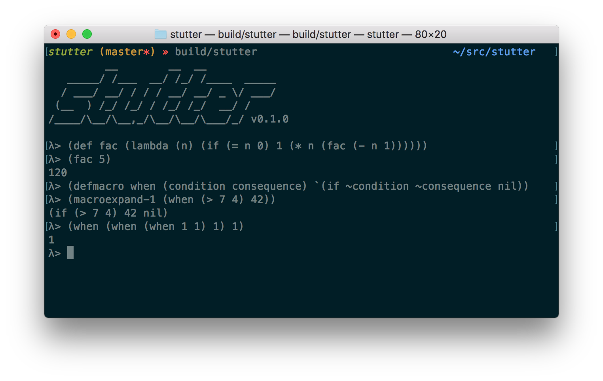

Stutter - Lisp, from scratch, in C
==================================



`stutter` is an educational Lisp interpreter implementation in C, written
entirely from scratch, not using any libraries (with the notable exception of
`editline` to maintain my sanity).

In other words, `stutter` is a practical exercise in a broad set of CS topics
including

* formal languages (lexing, parsing, abstract syntax trees)
* metalinguistic evaluation (eval/apply, macros)
* data structures (lists, trees, maps, arrays)
* automatic memory management (mark & sweep garbage collection)

All of it is implemented in one of the most bare-bones, down-to-earth
(and unforgiving) languages out there: C99.

`stutter` is a work in progress (and will be, for the forseeable future). See
[the tests](test/lang/) to get an idea of what the language is already capable
of.


The Rules
---------

Obviously, in modern our modern times, writing a Lisp interpreter is not
as challenging as it used to be since there are a lot of libraries that can
help us to achieve that goal. Hence, two rules:

1. Write everything from scratch.
2. Do not question the rules.


Getting started
---------------

Clone the repo and its submodules (submodules because the garbarge collector is in a [separate repo](https://github.com/mkirchner/gc)).

```bash
$ git clone --recursive git@github.com:mkirchner/stutter.git
$ cd stutter
$ make && make test
```

This should work on a Mac with a recent `clang`. No efforts to make it portable
(yet).


### Next steps

- [ ] Add a VM and support to compile to bytecode
- [ ] Document core language
- [ ] Better error reporting
  - [ ] Surface lexer token line/col info in the reader
- [ ] Core capabilities
  - [ ] `keyword` support
  - [ ] `vector` support (`Array` C type is implemented but not surfaced)
  - [ ] `hash-map` support (`Map` C type is available but not surfaced)
- [ ] Add a type system
