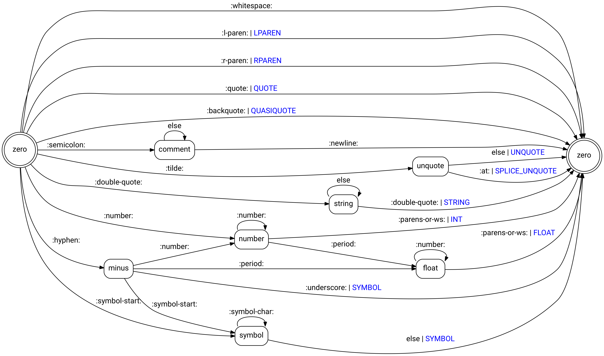

# The Lexer

> \[...\] lexical analysis, lexing or tokenization is the process of
> converting a sequence of characters (such as in a computer program
> \[...\]) into a sequence of tokens (strings with an assigned and thus
> identified meaning). A program that performs lexical analysis may be
> termed a lexer \[...\] -- Wikipedia, [Lexical
> Analysis](https://en.wikipedia.org/wiki/Lexical_analysis)

## Introduction

The first step for any interpreter is to convert the source code into an
in-memory representation called the abstract syntax tree (AST) that is
suitable for interpretation.

It is a standard practice (and very reasonable engineering) to split
that into two phases called *lexing* and *parsing*. The phases are
strictily sequential and cover two levels of abstraction: Lexing
identifies *tokens* in the input stream, parsing interprets these tokens
in the context of a language grammar.

The part of the interpreter code that implements lexing is called the
*lexer*. The *Lexer* takes a stream of characters and converts them into
a stream of tokens, e.g. the string

    "3 * ( 4 + 5.2 )"

yields the sequence

    INT(3), STRING(*), LPAREN, INT(4), STRING(+), FLOAT(5.2), RPAREN

which is subsequently fed into the parser.

## Design / Concept

We model the lexer as a deterministic [finite state
transducer](https://en.wikipedia.org/wiki/Finite-state_transducer) (FST)
and, more specifically, as a [Mealy
machine](https://en.wikipedia.org/wiki/Mealy_machine). An FST is a
[finite state
automaton](https://en.wikipedia.org/wiki/Finite-state_machine) (FSA)
that maps an input alphaet (the character stream from the source file)
to an output alphabet (the stream of lexer tokens). An FST defines a set
of accepted input strings and also maps the input to a new output.

Here are the tokens that the `stutter` lexer needs to detect and their
definition in terms of regular
expressions:

|           Token | Characters                                                       |
| --------------: | :--------------------------------------------------------------- |
|             EOF | `EOF`                                                            |
|          LPAREN | `(`                                                              |
|          RPAREN | `)`                                                              |
|      QUASIQUOTE | <code>\`</code> (single backtick)                                |
|         UNQUOTE | `~`                                                              |
| SPLICE\_UNQUOTE | `~@`                                                             |
|          STRING | `"[^"]"` (should be `\"(\\.\|[^\"])*\"` to allow string escapes) |
|          SYMBOL | `[a-zA-Z+*-/<>=][0-9a-zA-Z!&*+-<=>?@]*`                          |
|             INT | `[0-9]+`                                                         |
|           FLOAT | `[0-9]+`                                                         |

Note that we make two simplifying decisions here: (1) a `SYMBOL` cannot
start with a number (this is actually quite common across programming
languages); and (2) we do not (yet) implement string escapes.

Since we are committed to hand-rolling all lexer code (instead of using
a regular expression library), it makes sense to detail the design phase
and explicitly create the [state transition
diagram](https://en.wikipedia.org/wiki/State_diagram#Example:_Mealy_machine)
of the FST:



`stutter` implements the state transition diagram in the simplest
possible way: as a series of nested `case` statements in a loop. The
loop will keep reading one character at a time from the input stream
until the input returns EOF; the first level of `case` nesting will
manage the FST state and the second level the action on each input in
each state. The implementation occasionally makes use of a lookahead
token to keep things simple.

Here is the outer loop:

``` c
while ((c = fgetc(l->fp)) != EOF) {
    lexer_advance_next_char(l);
    switch (l->state) {
    case LEXER_STATE_ZERO:
        ...
    case LEXER_STATE_COMMENT:
        ...
    case LEXER_STATE_UNQUOTE:
        ...
    ...
    }
}
```

The code keeps reading from the input file pointer `fp`, advances the
character count, and switches upon the current state of the lexer.

Inside the outer `case` statements, we take action according to the
rules defined for a particular state, e.g. `STRING`:

``` c
...
case LEXER_STATE_STRING:
    if (c != '\"') {
    buf[bufpos++] = c;
    if (c == '\n') lexer_advance_next_line(l);
    } else {
    /* don't put c in the buffer */
    l->state = LEXER_STATE_ZERO;
    return lexer_make_token(l, LEXER_TOK_STRING, buf);
    }
    break;
...
```

Here, we check for the occurence of quotation marks to signify the end
of the string, managing line breaks if we see them. Once we hit
quotation marks, we create a new `STRING` token and return it to the
caller.

That said, it is Important to note that hand-rolling the lexer is not a
best practice and, in particular, hand-rolling the inner `case`
statements is something best not done in production (rely on a regex
library instead\!).

## Further reading

There is a vast body of literature for state automata and their relation
to formal language theory. For a quick overview, the Wikipedia pages on
[Automata Theory](https://en.wikipedia.org/wiki/Automata_theory) and
[FSMs](https://en.wikipedia.org/wiki/Finite-state_machine) are good
starting points. Some of the standard literature in the field are the
textbooks by
[Aho](https://amzn.to/38SJVnV)\[[1](#ref-aho_86_compilers)\],
[Sipser](https://amzn.to/2Vd0vek)\[[2](#ref-sipser_12_introduction)\]
and
[Hopcroft](https://amzn.to/2PhNOuX)\[[3](#ref-hopcroft_13_introduction)\].

## Interface/API

``` c
/* object lifecycle */
Lexer *lexer_new(FILE *fp);
void lexer_delete(Lexer *l);

/* interface */
LexerToken *lexer_get_token(Lexer *l);
void lexer_delete_token(LexerToken *tok);
```

## Implementation details

### The lexer struct

A lexer instance needs to keep track of (1) the file (pointer) it is
operating on; (2) it position within that file (in terms of line &
characer pos); and (3) it's internal state to enable stateful (read:
finite state machine) parsing.

The implementation is

``` c
typedef struct {
    FILE *fp;
    LexerState state;
    size_t line_no;
    size_t char_no;
} Lexer;
```

and we define `LexerState` as an `enum` with

``` c
typedef enum {
    LEXER_STATE_ZERO,
    LEXER_STATE_COMMENT,
    LEXER_STATE_NUMBER,
    LEXER_STATE_FLOAT,
    LEXER_STATE_SYMBOL,
    LEXER_STATE_STRING,
    LEXER_STATE_UNQUOTE,
    LEXER_STATE_MINUS
} LexerState;
```

Implementing the lexer lifecycle is simple: a `Lexer` instance requires
a constructor that takes a file pointer and a trivial destructor that
deletes the allocated memory:

``` c
Lexer *lexer_new(FILE *fp)
{
    Lexer *lexer = (Lexer *) malloc(sizeof(Lexer));
    *lexer = (Lexer) {
        .fp = fp,
        .state = LEXER_STATE_ZERO,
        .line_no = 1,
        .char_no = 0
    };
    return lexer;
}

void lexer_delete(Lexer *l)
{
    free(l);
}
```

### Lexer tokens

We implement a lexer token as a *tagged union* (also called a
*variant*). Different token types must store different types of data
(e.g. a string token will collect character data, whereas the integer
and float tokens will hold integer and double precision numbers,
respectively). A tagged union consists of a type indicator and a union
field. At any point in time, the union only holds one of its values,
either a string, an integer, or a float, as indicated by the value of
the type variable.

``` c
typedef struct {
    TokenType type;
    union {
        char* str;
        int int_;
        double double_;
    } value;
} LexerToken;
```

We also add convenience macros for easy access

``` c
#define LEXER_TOKEN_VAL_AS_STR(t) (t->value.str)
#define LEXER_TOKEN_VAL_AS_INT(t) (t->value.int_)
#define LEXER_TOKEN_VAL_AS_FLOAT(t) (t->value.double_)
```

and model the `TokenType` as a typdef'd enum:

``` c
typedef enum {
    LEXER_TOK_ERROR,
    LEXER_TOK_INT,
    LEXER_TOK_FLOAT,
    LEXER_TOK_STRING,
    LEXER_TOK_SYMBOL,
    LEXER_TOK_LPAREN,
    LEXER_TOK_RPAREN,
    LEXER_TOK_QUOTE,
    LEXER_TOK_QUASIQUOTE,
    LEXER_TOK_UNQUOTE,
    LEXER_TOK_SPLICE_UNQUOTE,
    LEXER_TOK_EOF
} TokenType;
```

In order to simplify printing the token names we also declare an array
of strings that will hold the token names:

``` c
extern const char *token_type_names[];
```

Creating a new instance of a lexer token is slightly more involved: we
pass the desired `TokenType` and a character buffer (that has beed read
from the file pointer of the `Lexer` object). For the token types that
require a string, we simply duplicate the buffer to the `char *`
pointer. If we require an integer or a float type, we fall back on the
`atoi()` and `atof()` functions, respectively:

``` c
static LexerToken *lexer_make_token(TokenType token_type, char *buf)
{
    LexerToken *tok = (LexerToken *) malloc(sizeof(LexerToken));
    if (tok) {
        tok->type = token_type;
        switch(token_type) {
        case LEXER_TOK_INT:
            tok->value.int_ = atoi(buf);
            break;
        case LEXER_TOK_FLOAT:
            tok->value.double_ = atof(buf);
            break;
        case LEXER_TOK_STRING:
        case LEXER_TOK_ERROR:
        case LEXER_TOK_SYMBOL:
        case LEXER_TOK_LPAREN:
        case LEXER_TOK_RPAREN:
        case LEXER_TOK_QUOTE:
        case LEXER_TOK_QUASIQUOTE:
        case LEXER_TOK_UNQUOTE:
        case LEXER_TOK_SPLICE_UNQUOTE:
            tok->value.str = strdup(buf);
            break;
        case LEXER_TOK_EOF:
            tok->value.str = NULL;
            break;
        }
    }
    return tok;
}
```

Deleting a token is equally simple: if the tagged union holds a token
type for which we allocated a string buffer, we clean the allocation
before freeing the token itself:

``` c
void lexer_delete_token(LexerToken *t)
{
    switch(t->type) {
    case LEXER_TOK_INT:
    case LEXER_TOK_FLOAT:
    case LEXER_TOK_EOF:
        break;
    case LEXER_TOK_STRING:
    case LEXER_TOK_ERROR:
    case LEXER_TOK_SYMBOL:
    case LEXER_TOK_LPAREN:
    case LEXER_TOK_RPAREN:
    case LEXER_TOK_QUOTE:
    case LEXER_TOK_QUASIQUOTE:
    case LEXER_TOK_UNQUOTE:
    case LEXER_TOK_SPLICE_UNQUOTE:
        free(t->value.str);
        break;
    }
    free(t);
}
```

# Bibliography

::: {\#refs} :::

<div id="refs" class="references">

<div id="ref-aho_86_compilers">

\[1\] A. V. Aho, R. Sethi, and J. D. Ullman, *Compilers: Principles,
techniques and tools (also known as the red dragon book)*.
Addison-Wesley, 1986.

</div>

<div id="ref-sipser_12_introduction">

\[2\] M. Sipser, *Introduction to the theory of computation*. Cengage
Learning, 2012.

</div>

<div id="ref-hopcroft_13_introduction">

\[3\] J. Hopcroft, R. Motwani, and J. Ullman, *Introduction to automata
theory, languages, and computation: Pearson new international edition*.
Pearson Education Limited, 2013.

</div>

</div>
